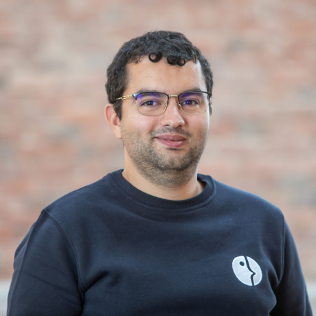
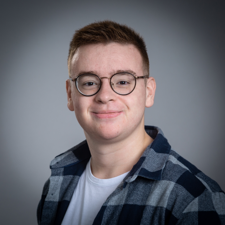
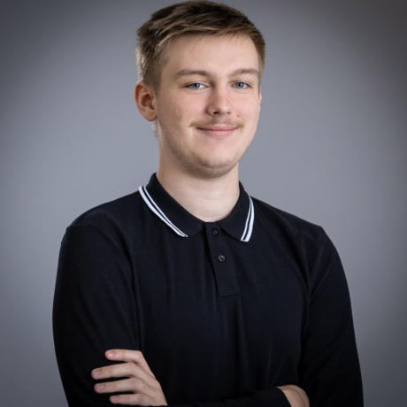

# Project Charter - Team 2

## Project : Web FPGA

### Team members

| Name        | Role                | Picture                             | Social Link                             | Responsibilities                                                                                                                                                                             |
| ----------- | ------------------- | ----------------------------------- | --------------------------------------- | -------------------------------------------------------------------------------------------------------------------------------------------------------------------------------------------- |
| Enoal       | Project Manager     |        | [GitHub](https://github.com/EnoGame29)  | Responsible for project management, including timelines, planning, and team coordination. Has a role in the choices of the functional aspects of the project.                                |
| Salaheddine | Program Manager     |  | [GitHub](https://github.com/T3rryc)     | Decides of the functional aspects of the project, interfaces and so on. Manages functional specification development and client communication for the project.                               |
| Léna        | Technical Leader    |          | [GitHub](https://github.com/lenadg18)   | Guides technical decisions and translates functional requirements into scalable technical solutions. Choices the coding standards, how the language will be used into the project.           |
| Lucas       | Software Engineer 1 |        | [GitHub](https://github.com/LucasAub)   | Develops and implements codebase, ensures code quality and is governed by technical aspects to create the software.                                                                          |
| Ian         | Software Engineer 2 |            | [GitHub](https://github.com/Ianlaur)    | Develops and implements codebase, ensures code quality and is governed by technical aspects to create the software.                                                                          |
| Mattéo      | Quality Assurance   |      | [GitHub](https://github.com/Mattstar64) | Creates tests to validate the quality of the software; that is to say, searches for any types of problems, finds how to optimize the code and reports these issues to the Software Engineer. |

### Deadlines

| Document                  | Type     | Deadline     |
| ------------------------- | -------- | ------------ |
| Functional Specifications | Document | 03/13/2025   |
| Technical Specifications  | Document | 03/25/2025   |
| Test Plan                 | Document | 03/25/2025   |
| Final Product             | Software | 04/01/2025   |
| Weekly Reports            | Document | Every Monday |

### Project Description

The purpose of the 4th project of the year is to create the front-end interface of a web-based FPGA (Field-Programmable Gate Array) simulator. It will helps students to understand how the FPGA works through the teacher explanations and the website. The teacher will be able to submit the construction documents (.sdf and .v documents) to create the various diagrams (3 in total) and the students will be able to see these schemas and works on it.

#### Objectives
- Create the front-end of an FPGA simulator website.
- Use a programming language (any) to create the software.
- Allow the teacher to submit construction documents
  - Load .v files.
  - Load .sdf files.
- Create a parser that transforms the files into JSON file, readable for the website.
- Allow the student to see the diagrams and work on them.
- Creation of a fixed, animated and with values schema.

#### Stakeholders

| Representative           | Role       | Contact     | Expectation                                                                                                                            |
| ------------------------ | ---------- | ----------- | -------------------------------------------------------------------------------------------------------------------------------------- |
| Florent MANNI (CNES)     | Client     | Email/Slack | The client expects a fully functional web-based FPGA simulator that can be used in the classroom to teach students how to use an FPGA. |
| Franck JEANNIN (ALGOSUP) | Supervisor | Slack       | The supervisor ensures that project deadlines are met and that the software is usable at the end.                                      |

#### Scope

- A front-end interface that allows the teacher to submit construction documents.
- A front-end interface that allows the student to see the diagrams and work on them.
- Load .v and .sdf files.
- Creation of a fixed -> animated -> with values schema.

#### Nice to Have

- Download or share schema (Optional).

#### Out of scope

- The back-end part of the project (Optional).
- Direct implementation of the code (No code writing but files insertion).

#### Budget Allocation

- No budget is allocated for this project. All the hardware (if created) are to be paid by members. Also, all ressources and the software have to be obtained and sold for free.

### Glossary

| Name   | Description                                                                                                                                                                                                                                                                     |
| ------ | ------------------------------------------------------------------------------------------------------------------------------------------------------------------------------------------------------------------------------------------------------------------------------- |
| FPGA   | *aka Field-Programmable Gate Array*   A type of integrated circuit that can be configured by the user or designer after manufacturing, often used in specialized gaming platforms.                                                                                           |
| .v     | The name of the extension for the Verilog files.                                                                                                                                                                                                                                |
| .sdf   | The name of the extension for the Standard Delay Format files.                                                                                                                                                                                                                  |
| CNES   | *aka Centre National d'Études Spatiales*   CNES is the French national space agency. It is Europe's largest national organization of its type.                                                                                                                               |
| JSON   | *aka JavaScript Object Notation*   A lightweight data interchange format that is easy for humans to read and write, and easy for machines to parse and generate. It is often used for transmitting data in web applications, such as sending data from a server to a client. |
| Slack  | A messaging app for business that connects people to the information they need. It is a workplace communication tool that provides a single place for messaging, tools, and files.                                                                                              |
| GitHub | A web-based platform that hosts Git repositories, providing developers with tools for version control and collaboration.                                                                                                                                                        |