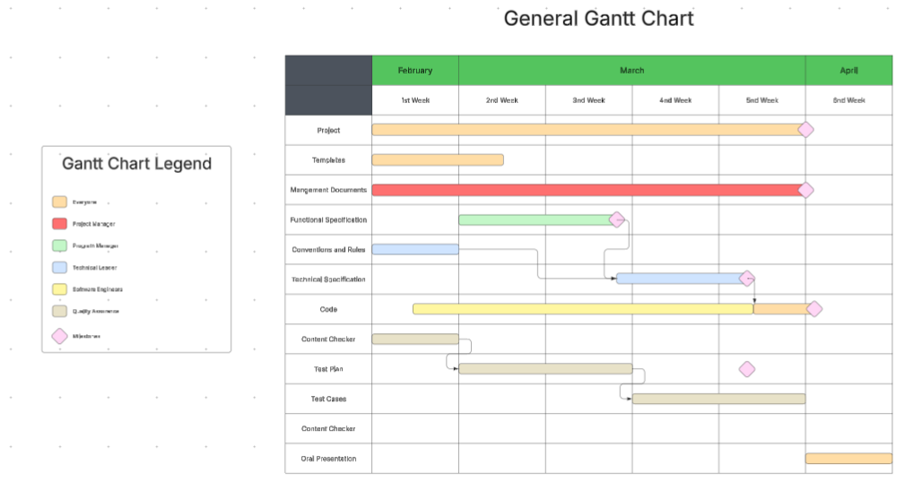

# Weekly Report 1 - Team 2: "Web FPGA"

# 1st Week: 03/24/25 - 03/28/25

## Overview

#### Discovery of the Project

In this week, we met with our client to find out what he really wanted us to achieve. Thanks to this meeting, all team members were less lost about the direction to follow, which saved considerable time. Thus, we have to produce the interface of the website (the front-end part) that will help the professor explain what FPGAs are to his students.

### Conventions and Structure

The coding conventions as well as the files/folder conventions and structure have been written allowing a good organization within the team, especially the developers.

### Website

The developers succeed to create a parser file (a kind of translator) that can convert .v and .sdf files into a .JSON file (a file understandable for the browsers).  
The two side of the webpage (front and back-end) for the student and the teacher have been finished.   
They also starting to create the schematics (asking by the client) thanks to this JSON file.

### Templates

Templates have been drawn up for all issues (for quality assurance) and for all documents.

## Management Planing

### KPIs

| KPI                                     | Progress |
| --------------------------------------- | -------- |
| Functional Specification                | 10%      |
| Technical Specification                 | 5%       |
| Conventions + Structure                 | 100%     |
| Parser                                  | 100%     |
| Automate creating the simple schematics | 50%      |
| Connecting wire between components      | 35%      |
| Sides of the website on the Home Page   | 100%     |
| POC                                     | 65%      |
| Test Plan                               | 20%      |
| Issues Template (Test Cases-related)    | 100%     |

### Gantt Chart

A Gantt Chart was started, to precisely indicate the amount of time that a task has to be done after consultations with the team. It also indicates all the deadlines (materialized by squares).

A specific part for the code (and all long tasks) will be done during the week.

You can access to the Gantt Chart through this [link](../ManagementArtifacts/gantt_chart.svg)

### Time Management

All the time dedicated to the project is currently recorded in a Google Sheet to track the hours spent on the project. It includes the hours of project, the absence and overtime of the team members.

## Key Goals for Week 2

- Moving forward on the Functional and the Test Plan.
- Trying to finish the simple schematics automatic creation.
- Progress on the POC.