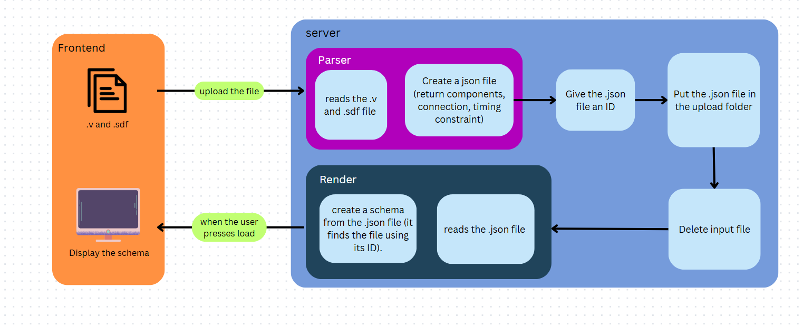

# Technical Specification

<div align="center">

**Project Name:** Web FPGA
**Team:** Team 2  
**Document Edited by:** Léna<br>
**Last Time Modified:** 03/13/2025

</div>


## Table Of Contents

<details close>
<summary>Table Of Contents</summary>
</details>

## Introduction
The project consists of creating a web page that simulates the behavior of an FPGA[^FPGA] and generates, from a .v and .sdf file, a blueprint of the FPGA with its components and the connections between them. It is intended to be used to teach people how signals propagate inside an FPGA.

## Objectives

- The teacher will access the web page, use the functionality to load a .v and .sdf file, and simulate an FPGA to generate a blueprint of its components and their connections.

- The web page will provide a user-friendly interface for the teacher to interact with.

- The blueprint can be downloaded or shared as a .png file

- The teacher will access the web page, use this functionality, and share it with students to explain how an FPGA works.

- Students will view the web page while the teacher explains and simulates the FPGA's behavior.


## Project Folder Structure

```bash
📦2024-2025-project-4-web-fpga-team-2-programs
├──📁Documents   # folder that stores all the main files
│  ├──📁Functional
│  │  └──📁Images
│  │  └──📝functionalSpecification.md
│  │  
│  ├──📁Management
│  │  └──📁Images   
│  │  └──📁ManagementArtifacts
│  │  └──📁WeeklyReports
│  │                     
│  ├──📁QualityAssurance
│  │  └──📁Images    
│  │  └──📝testCaseRules.md  
│  │  └──📝testPlan.md   
│  │              
│  ├──📁Technical                                
│  │  └──📁Images
│  │  └──📝technicalSpecification.md
│  │  └──📝convention.md
│
├──📁src                                          
├──📄.gitignore   # ignore the file mentioned inside                      
├──📝README.md
├──📝LICENSE
```
## Conventions

There are conventions to follow during the project.
You can check them using this link :
[Convention](https://github.com/algosup/2024-2025-project-4-web-fpga-team-2/blob/main/Documents/Technical/convention.md)

## Requirements

To see all requirements it is recommended to read the [functional specification](https://github.com/algosup/2024-2025-project-4-web-fpga-team-2/blob/main/Documents/Functional/functionalSpecification.md) document.

## Technologies used

### HTML, CSS And JavaScript

- HTML[^html] will be used to build the website's structure.
- CSS[^css] will be used for the website's design.
- JavaScript[^js] will be used to interactivity between client and website.

### JSON
- JSON[^json] will be used to exchange information between the server and the web application.

### Node.js, React And TypeScript

- Node.js[^node.js] will be used to create an http server and manage API requests with Express.
- React[^react] will be used for the circuit visualizer(render).
- TypeScript[^TypeScript] will be used for the circuit visualizer.
- D3.js[^d3js] will be used to zoom in and out on the circuit diagram or manipulate the DOM.


### Parser  

To read the .v and .sdf file, a parser will be used. The parser reads the file and translate it into a .json file, facilitating data exchange and transmission.

## Frontend

### Overview
The front end of the website will be made using HyperText Markup Language (HTML), Cascading Style Sheets (CSS) , and JavaScript (JS).

HTML is used to build the structure of the website , which can then be interpreted by any browser on any hardware to display the website.<br>
We then use CSS to modify the appearance of the website, making it more visually appealing, which results in a more attractive website and a better user experience.  <br>
Finally, JS is used to handle events and modify the webpage directly from the browser, such as load a file.


### Display The Circuit

The file CircuitVisualizer.tsx will be placed in the “Frontend” folder.
This file will be the render of this project.
 
To display a circuit the program need a JSON file.

- fetch will be used to retrieve the JSON file containing the circuit information.
- the D3.js library is will be used to zoom in and out on the circuit diagram.
- Dagre (in the D3.js library) is will be used to automatically arrange circuit components in the form of oriented graphs.
- D3.js is will be used to manipulate the DOM (Document Object Model), draw circles for pins and connect components with lines (arcs or segments).
- The D3.js library is will be used to generate and display the SVG graphic, making the circuit interactive and manipulable (zoom, move).


### Animation

As stated in the functionnal, it must have an animation representing the current flowing between the various circuit components.


## Backend

### Server

The server.js file will be placed in the “Backend” folder along with the parser.js file.<br>
The server will be a Node.js Server.
This is an HTTP server that also hosts a WebSocket server, both running on the same underlying HTTP server.

<strong>What the server has to do :</strong>

- <strong>The server enables real-time communication</strong><br>
  We will use WebSocket to allow the server to enable real-time communication by instantly broadcasting updates to all connected clients whenever a circuit is uploaded, processed, or deleted.

- <strong>Manage Database</strong><br>
  The server uses an SQLite database to store metadata about uploaded circuits.<br>
    Each circuit entry includes a unique ID, name, creation date, JSON file path, and description.<br>
    The database ensures that circuits can be listed, retrieved by ID, and deleted when needed.<br>
    When a circuit is deleted, the corresponding database entry and JSON file are removed to keep the storage clean.

- <strong>API REST</strong><br>
  POST : Must be able to upload two files (Verilog and SDF), which are then processed to generate a JSON file representing the circuit. <br>
  GET : Retrieves a list of existing circuits or detailed information on a specific circuit via its ID. <br>
  DELETE : The teacher will be able to delete a file that has already been upload.
  

- <strong>Generates an upload folder</strong><br>
 The folder upload will be generated only when it doesn't exist. <br>
 It can be accessed using the HTTP protocol.<br>
 This folder will contain all files downloaded by the teacher in JSON format.

- <strong>Gives a name to the JSON file created in the upload folder</strong><br>
  To do this, we'll use the Multer module. <br>
  The file of each file will be based on the date and the original file's extension.


### When You Upload A File(POST)

For the teacher, here's how to upload a file. 




### Delete A File(DELETE)

the teacher will be able to delete a file that has already been upload.

There will be a folder called “upload” containing all the files uploaded by the teacher in json format.

To delete a file, the teacher presses the “delete” button and the file is removed from the folder and the SQLite database.

- the server extracts the circuit ID from the URL of the HTTP request.
- An SQL query is sent to the database to find the circuit entry.
  - if the circuit wasn't found : send "404 circuit not found"
  - if the circuit was found : delete the JSON file in the folder upload and delete circuit in the database with this SQL request.
    ```SQL
    DELETE FROM circuit WHERE id = CircuitIdDeleted ;
    ```
- All clients connected via WebSocket receive notification that a circuit has been deleted.


## Glossary


[^FPGA]: FPGA is an acronym for Field Programmable Gate Array. it is an integrated circuit with basic elements and preconfigured electrical signal routes between them. [source](http://en.wikipedia.org/wiki/Field-programmable_gate_array)

[^html]: HTML is an acronym for Hypertext Markup Language that is the standard markup language for documents designed to be displayed in a web browser. [Source](https://en.wikipedia.org/wiki/HTML)

[^css]: CSS is an acronym for Cascading Style Sheets that is a style sheet language used for specifying the presentation and styling of a document written in a markup language. [Source](https://en.wikipedia.org/wiki/CSS)

[^js]: is a programming language and core technology of the World Wide Web, alongside HTML and CSS.[Source](https://en.wikipedia.org/wiki/JavaScript)


[^json]: JSON is an acronym for JavaScript Object Notation an open standard file format and data interchange format that uses human-readable text to store and transmit data objects consisting of name-value pairs and arrays (or other serializable values). [Source](https://en.wikipedia.org/wiki/JSON)

[^node.js]: Node.js an asynchronous event-driven JavaScript runtime that is designed to build scalable network applications. [Source](https://nodejs.org/en/about)

[^react]: React is a library for web and native user interfaces. [Source](https://react.dev/)

[^TypeScript]: TypeScript is a syntactic superset of JavaScript which adds static typing. [Source](https://www.typescriptlang.org/)

[^d3js]: D3.js is JavaScript library for bespoke data visualization. [Source](https://d3js.org/)